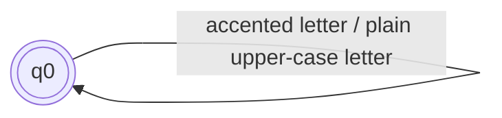
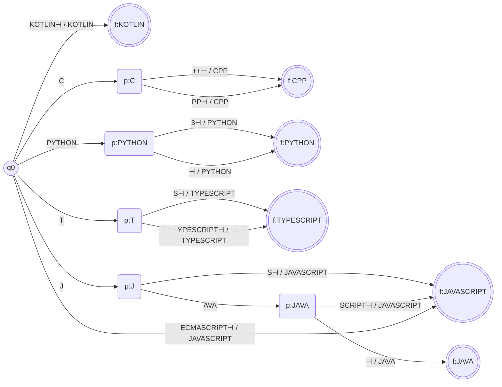
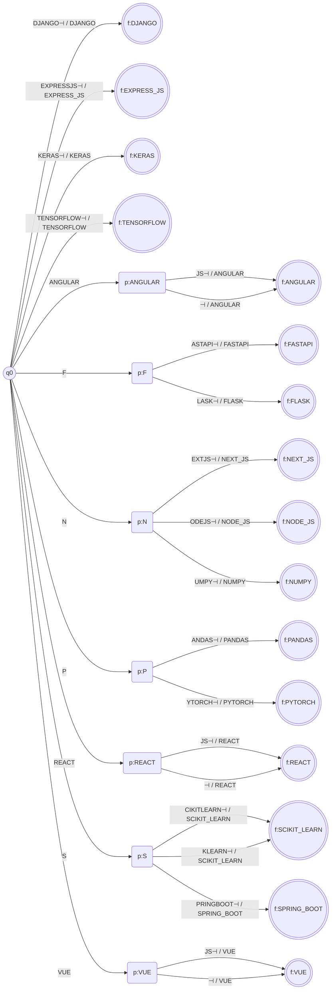
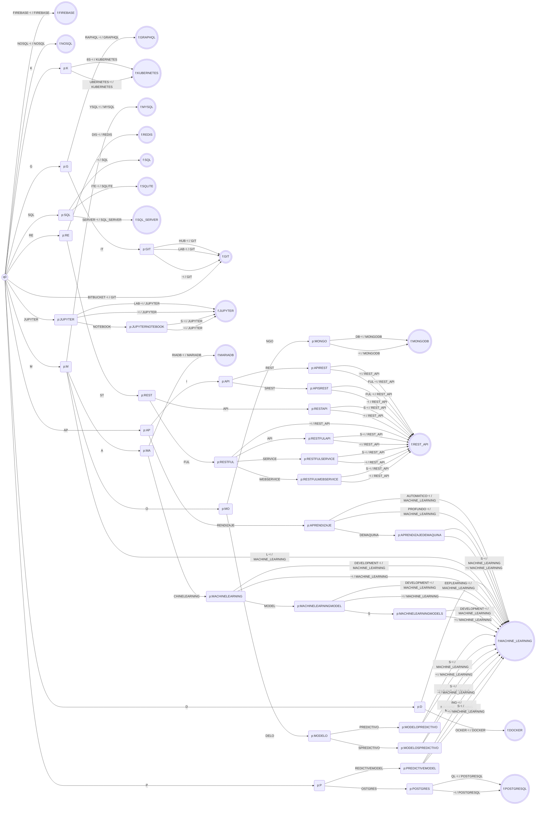

# Stage 2 - Transducers: formal definitions and diagrams

Implementation: `src/normalization/fst.py` (builders), `transducers.py` (the
three dictionaries) and `variants.py` (the data). The diagrams of this file are
generated from the machines of the code with
`python -m src.normalization.diagrams`, and a test checks that they are up to
date (`tests/test_normalization_docs.py`).

The design (why two kinds of machines, the dictionary of variants and the
decisions taken) is in `docs/normalization-design.md`. Sorting is not done by a
transducer; see `docs/normalization-sorting.md`.

## 1. Notation

Every transducer is a 7-tuple, as in the assignment:

```
M = (Q, Σ, Γ, δ, ω, q0, F)
```

| Symbol | Meaning |
|---|---|
| Q | finite set of states |
| Σ | input alphabet |
| Γ | output alphabet |
| δ | transition function `δ: Q × Σ → Q` (partial: a missing transition rejects) |
| ω | output function `ω: Q × Σ → Γ*`, the string written when the transition `δ(q, a)` is taken |
| q0 | initial state |
| F | set of accepting states |

A run **accepts** a string if it reads all of it and stops in F. The output of
the run is the concatenation of the `ω` of every transition it took. A string
that is not accepted has no output.

**Correspondence with `pyformlang`.** The library does not keep δ and ω apart:
`fst.add_transition(q, a, q2, [x1, x2])` records both `δ(q, a) = q2` and
`ω(q, a) = x1 x2` (the list can be empty, which is `ε`). `fst.translate(word)`
returns the outputs of all the accepting runs, and nothing if there is none.
All our machines are deterministic (`is_deterministic` is tested), so there is
at most one output.

| Formal element | In the code |
|---|---|
| Q | `fst.states` |
| Σ, Γ | `fst.input_symbols`, `fst.output_symbols` |
| δ and ω | `fst.transitions`: `(q, a) -> [(q2, [outputs])]` |
| q0 | `fst.start_states` |
| F | `fst.final_states` |

## 2. Sizes

| Transducer | \|Q\| | \|Σ\| | \|Γ\| | \|δ\| | \|F\| |
|---|---|---|---|---|---|
| C (cleaner) | 1 | 112 | 37 | 112 | 1 |
| languages | 57 | 20 | 6 | 61 | 6 |
| frameworks | 132 | 25 | 16 | 135 | 16 |
| databases_tools | 332 | 27 | 17 | 370 | 17 |

## 3. Transducer C: the cleaner

It reads a raw string and writes its key. It has a single state that is
initial and final, and a loop on every symbol of Σ.

| Element | Definition |
|---|---|
| Q | {`q0`} |
| Σ | `a-z`, `A-Z`, `0-9`, `+`, the separators ` ` (space), tab, `-`, `.`, `_`, and the accented letters `áàäâéèëêíìïîóòöôúùüûñçÁÀÄÂÉÈËÊÍÌÏÎÓÒÖÔÚÙÜÛÑÇ` |
| Γ | `A-Z`, `0-9`, `+` |
| δ | `δ(q0, a) = q0` for every `a` in Σ |
| ω | `ω(q0, a)` = the upper-case letter for `a-z`; `a` itself for `A-Z`, `0-9` and `+`; `ε` for a separator; the letter without accent, in upper case, for an accented letter (`á -> A`, `ñ -> N`, `Ü -> U`) |
| q0 | `q0` |
| F | {`q0`} |



What the state remembers: nothing. C does not need memory, it only rewrites one
character at a time, so one state is enough.

| Input | Run | Output |
|---|---|---|
| `Node.js` | N→N, o→O, d→D, e→E, `.`→ε, j→J, s→S | `NODEJS` |
| `scikit learn` | s→S, c→C, ..., t→T, space→ε, l→L, ..., n→N | `SCIKITLEARN` |
| `aprendizaje automático` | ..., space→ε, ..., á→A, ... | `APRENDIZAJEAUTOMATICO` |
| `C++` | C→C, +→+, +→+ | `C++` |
| `C#` | C→C, then no transition for `#` | rejected |
| `CI/CD` | C→C, I→I, then no transition for `/` | rejected |

## 4. Transducers D: the dictionaries

The three dictionaries have the same shape. Given a table of keys
`K = {(key, token)}` (the `key_map` of the group):

| Element | Definition |
|---|---|
| Q | `q0`, `p:w` for every non-empty prefix `w` of a key (the whole key included), `f:t` for every token `t` |
| Σ | the letters that appear in the keys, and the end marker `⊣` |
| Γ | the tokens of the table |
| δ | `δ(q0, a) = p:a`; `δ(p:w, a) = p:wa` if `wa` is a prefix of a key; `δ(p:k, ⊣) = f:t` for every `(k, t)` in K |
| ω | `ε` on every letter; `t` on the transition `(p:k, ⊣)` |
| q0 | `q0` |
| F | `{f:t}` for every token `t` |

The machine is a prefix tree. A state `p:w` remembers the prefix `w` that has
been read so far, and nothing else. Two keys of the same token end in the same
final state `f:t`, which is why the token is written on the end marker and not
on the last letter: `JAVA` and `JAVASCRIPT` share the path `J-A-V-A`, and only
the next symbol (`⊣` or `S`) tells them apart.

The diagrams are the **compact** form of the prefix tree: a state with one way
in and one way out is folded into its edge, so `S⊣ / JAVASCRIPT` on an edge is
the path `S`, `⊣` that writes `JAVASCRIPT`, and an edge labelled `AVA` is three
transitions that write nothing. Branching states, `q0` and the final states
are drawn. The full machine (for example `JS`) is:

```
q0 --J/ε--> p:J --S/ε--> p:JS --⊣/JAVASCRIPT--> f:JAVASCRIPT
```

### 4.1 `languages`

| Element | Definition |
|---|---|
| Q | `q0`, `p:w` for every non-empty prefix `w` of a key (the whole key included) and `f:t` for every token `t` of Γ. 57 states |
| Σ | {+, 3, A, C, E, H, I, J, K, L, M, N, O, P, R, S, T, V, Y, ⊣} |
| Γ | {`JAVASCRIPT`, `TYPESCRIPT`, `PYTHON`, `JAVA`, `KOTLIN`, `CPP`} |
| δ | `δ(q0, a) = p:a`; `δ(p:w, a) = p:wa` when `wa` is a prefix of a key; `δ(p:k, ⊣) = f:t` for every key `k` of the table below with token `t`. 61 transitions |
| ω | `ω(q, a) = ε` for a letter `a`; `ω(p:k, ⊣) = t` for the same pairs `(k, t)` |
| q0 | `q0` |
| F | {`f:t` : `t` in Γ}, 6 states |

Keys of the table:

| Token | Keys read before `⊣` |
|---|---|
| `JAVASCRIPT` | `ECMASCRIPT`, `JAVASCRIPT`, `JS` |
| `TYPESCRIPT` | `TS`, `TYPESCRIPT` |
| `PYTHON` | `PYTHON`, `PYTHON3` |
| `JAVA` | `JAVA` |
| `KOTLIN` | `KOTLIN` |
| `CPP` | `C++`, `CPP` |



| Input | C writes | D run | Output |
|---|---|---|---|
| `JS` | `JS` | `q0 -J-> p:J -S-> p:JS -⊣/JAVASCRIPT-> f:JAVASCRIPT` | `JAVASCRIPT` |
| `Java Script` | `JAVASCRIPT` | `q0 -J-> p:J -A-> ... -T-> p:JAVASCRIPT -⊣/JAVASCRIPT-> f:JAVASCRIPT` | `JAVASCRIPT` |
| `Java` | `JAVA` | `q0 -J-> p:J -A-> p:JA -V-> p:JAV -A-> p:JAVA -⊣/JAVA-> f:JAVA` | `JAVA` |
| `JAV` | `JAV` | stops in `p:JAV`, which has no `⊣` transition | rejected |
| `Rust` | `RUST` | `q0` has no transition on `R` | rejected |

### 4.2 `frameworks`

| Element | Definition |
|---|---|
| Q | `q0`, `p:w` for every non-empty prefix `w` of a key (the whole key included) and `f:t` for every token `t` of Γ. 132 states |
| Σ | {A, B, C, D, E, F, G, H, I, J, K, L, M, N, O, P, R, S, T, U, V, W, X, Y, ⊣} |
| Γ | {`REACT`, `ANGULAR`, `VUE`, `NEXT_JS`, `NODE_JS`, `EXPRESS_JS`, `DJANGO`, `FLASK`, `FASTAPI`, `SPRING_BOOT`, `PANDAS`, `NUMPY`, `SCIKIT_LEARN`, `TENSORFLOW`, `PYTORCH`, `KERAS`} |
| δ | `δ(q0, a) = p:a`; `δ(p:w, a) = p:wa` when `wa` is a prefix of a key; `δ(p:k, ⊣) = f:t` for every key `k` of the table below with token `t`. 135 transitions |
| ω | `ω(q, a) = ε` for a letter `a`; `ω(p:k, ⊣) = t` for the same pairs `(k, t)` |
| q0 | `q0` |
| F | {`f:t` : `t` in Γ}, 16 states |

Keys of the table:

| Token | Keys read before `⊣` |
|---|---|
| `REACT` | `REACT`, `REACTJS` |
| `ANGULAR` | `ANGULAR`, `ANGULARJS` |
| `VUE` | `VUE`, `VUEJS` |
| `NEXT_JS` | `NEXTJS` |
| `NODE_JS` | `NODEJS` |
| `EXPRESS_JS` | `EXPRESSJS` |
| `DJANGO` | `DJANGO` |
| `FLASK` | `FLASK` |
| `FASTAPI` | `FASTAPI` |
| `SPRING_BOOT` | `SPRINGBOOT` |
| `PANDAS` | `PANDAS` |
| `NUMPY` | `NUMPY` |
| `SCIKIT_LEARN` | `SCIKITLEARN`, `SKLEARN` |
| `TENSORFLOW` | `TENSORFLOW` |
| `PYTORCH` | `PYTORCH` |
| `KERAS` | `KERAS` |



| Input | C writes | D run | Output |
|---|---|---|---|
| `Node.js` | `NODEJS` | `q0 -N-> p:N -O-> ... -S-> p:NODEJS -⊣/NODE_JS-> f:NODE_JS` | `NODE_JS` |
| `sklearn` | `SKLEARN` | `q0 -S-> p:S -K-> ... -⊣/SCIKIT_LEARN-> f:SCIKIT_LEARN` | `SCIKIT_LEARN` |
| `scikit learn` | `SCIKITLEARN` | `q0 -S-> p:S -C-> ... -⊣/SCIKIT_LEARN-> f:SCIKIT_LEARN` | `SCIKIT_LEARN` |
| `Scikit` | `SCIKIT` | stops in `p:SCIKIT`, no `⊣` transition | rejected |
| `SciPy` | `SCIPY` | `p:SCI` has no transition on `P` | rejected |

### 4.3 `databases_tools`

| Element | Definition |
|---|---|
| Q | `q0`, `p:w` for every non-empty prefix `w` of a key (the whole key included) and `f:t` for every token `t` of Γ. 332 states |
| Σ | {8, A, B, C, D, E, F, G, H, I, J, K, L, M, N, O, P, Q, R, S, T, U, V, W, Y, Z, ⊣} |
| Γ | {`SQL`, `POSTGRESQL`, `MYSQL`, `MONGODB`, `MARIADB`, `SQL_SERVER`, `SQLITE`, `NOSQL`, `REDIS`, `FIREBASE`, `GIT`, `DOCKER`, `KUBERNETES`, `JUPYTER`, `REST_API`, `GRAPHQL`, `MACHINE_LEARNING`} |
| δ | `δ(q0, a) = p:a`; `δ(p:w, a) = p:wa` when `wa` is a prefix of a key; `δ(p:k, ⊣) = f:t` for every key `k` of the table below with token `t`. 370 transitions |
| ω | `ω(q, a) = ε` for a letter `a`; `ω(p:k, ⊣) = t` for the same pairs `(k, t)` |
| q0 | `q0` |
| F | {`f:t` : `t` in Γ}, 17 states |

Keys of the table:

| Token | Keys read before `⊣` |
|---|---|
| `SQL` | `SQL` |
| `POSTGRESQL` | `POSTGRES`, `POSTGRESQL` |
| `MYSQL` | `MYSQL` |
| `MONGODB` | `MONGO`, `MONGODB` |
| `MARIADB` | `MARIADB` |
| `SQL_SERVER` | `SQLSERVER` |
| `SQLITE` | `SQLITE` |
| `NOSQL` | `NOSQL` |
| `REDIS` | `REDIS` |
| `FIREBASE` | `FIREBASE` |
| `GIT` | `BITBUCKET`, `GIT`, `GITHUB`, `GITLAB` |
| `DOCKER` | `DOCKER` |
| `KUBERNETES` | `K8S`, `KUBERNETES` |
| `JUPYTER` | `JUPYTER`, `JUPYTERLAB`, `JUPYTERNOTEBOOK`, `JUPYTERNOTEBOOKS` |
| `REST_API` | `APIREST`, `APIRESTFUL`, `APISREST`, `APISRESTFUL`, `RESTAPI`, `RESTAPIS`, `RESTFUL`, `RESTFULAPI`, `RESTFULAPIS`, `RESTFULSERVICE`, `RESTFULSERVICES`, `RESTFULWEBSERVICE`, `RESTFULWEBSERVICES` |
| `GRAPHQL` | `GRAPHQL` |
| `MACHINE_LEARNING` | `APRENDIZAJEAUTOMATICO`, `APRENDIZAJEDEMAQUINA`, `APRENDIZAJEDEMAQUINAS`, `APRENDIZAJEPROFUNDO`, `DEEPLEARNING`, `MACHINELEARNING`, `MACHINELEARNINGDEVELOPMENT`, `MACHINELEARNINGMODEL`, `MACHINELEARNINGMODELDEVELOPMENT`, `MACHINELEARNINGMODELS`, `MACHINELEARNINGMODELSDEVELOPMENT`, `ML`, `MODELOPREDICTIVO`, `MODELOPREDICTIVOS`, `MODELOSPREDICTIVO`, `MODELOSPREDICTIVOS`, `PREDICTIVEMODEL`, `PREDICTIVEMODELING`, `PREDICTIVEMODELS` |



| Input | C writes | D run | Output |
|---|---|---|---|
| `Postgres` | `POSTGRES` | `q0 -P-> ... -S-> p:POSTGRES -⊣/POSTGRESQL-> f:POSTGRESQL` | `POSTGRESQL` |
| `GitHub` | `GITHUB` | `q0 -G-> ... -B-> p:GITHUB -⊣/GIT-> f:GIT` | `GIT` |
| `Machine-learning model development` | `MACHINELEARNINGMODELDEVELOPMENT` | one path of 31 letters, then `⊣/MACHINE_LEARNING` | `MACHINE_LEARNING` |
| `REST` | `REST` | stops in `p:REST`, no `⊣` transition (`REST` alone is not a spelling) | rejected |
| `Jenkins` | `JENKINS` | `p:J` has no transition on `E` (the only key that starts with `J` is `JUPYTER...`) | rejected |

## 5. How `normalize` uses them

`normalize_skill(raw)` runs C once, then tries the three dictionaries in the
order `languages`, `frameworks`, `databases_tools`. Their keys are disjoint, so
at most one accepts the key; if none does, the string has no canonical form and
`normalize` drops it.

```
raw --C--> key --D(languages)------\
               \--D(frameworks)-----+--> token, or dropped
                \--D(databases_tools)/
```

Sorting by profile is applied afterwards and is not a transducer
(`docs/normalization-sorting.md`).
